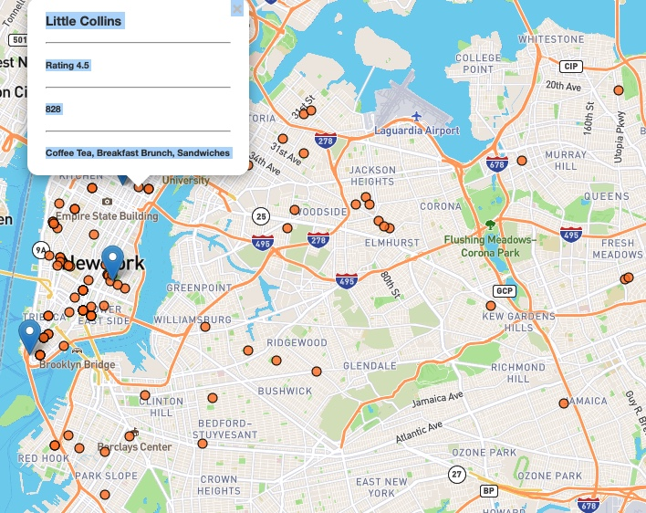
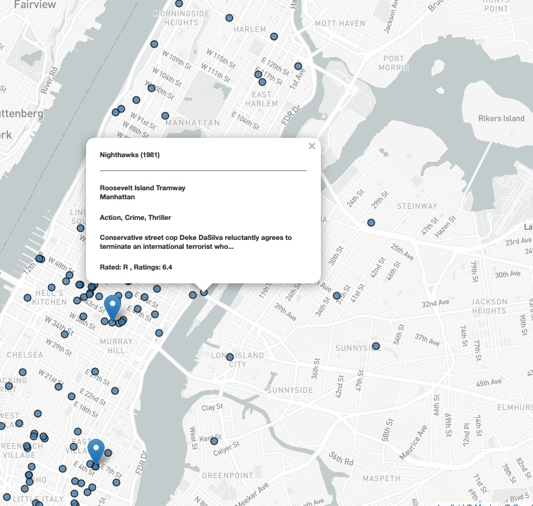
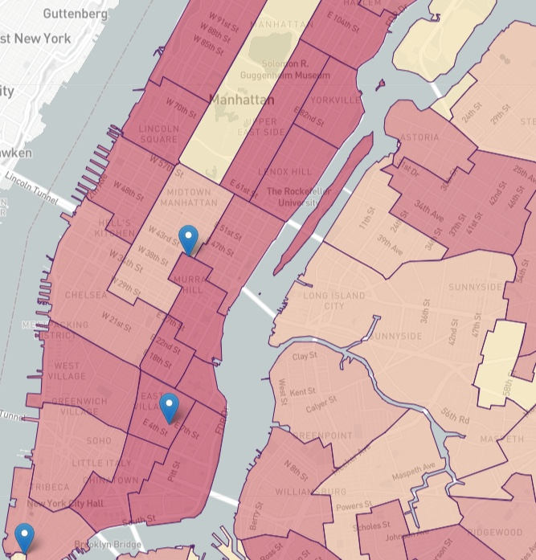

## Data Visualization Project

[Link to site](https://firedynasty.github.io/second_project/tenth_step_plus_airbnb/)

Deployed are New York Yelp ratings, movie ratings, demographics, and crime. 

As you can see by the layers that it will represent something different. 

My part of the project working on using the Yelp API to retrieve restaurant data.

Movie data was obtained from NYC Open Data.

### Yelp: 

### Movies:

### Demographics: 

